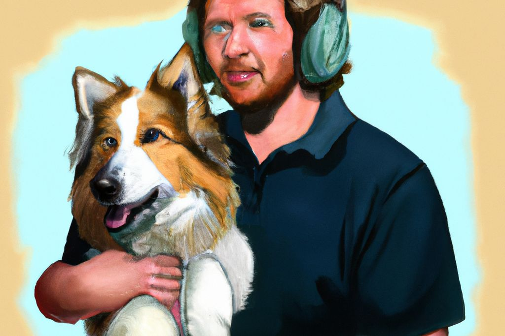

# Sharp POC

A quick [example](./index.js) showing how Filestack's [crop](https://www.filestack.com/docs/api/processing/#crop) method can be replicated by [extract](https://sharp.pixelplumbing.com/api-resize#extract) in Sharp.

---

  
  

  
  

